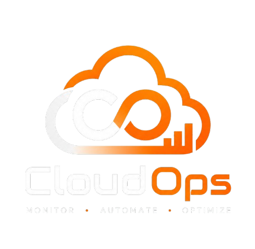
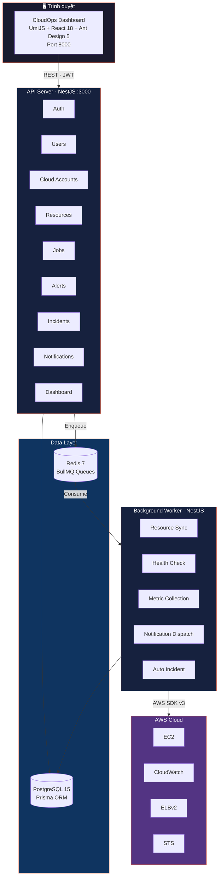

<p align="center">
  
</p>

<h1 align="center">CloudOps Platform</h1>

<p align="center">
  
  
  
  
  
  
</p>

<p align="center">
  <b>Nền tảng giám sát & vận hành hạ tầng cloud</b><br/>
  Kết nối AWS · Khám phá tài nguyên · Thu thập metrics · Cảnh báo · Quản lý sự cố
</p>

---

## Tính năng

- ** Kết nối Cloud** — Kết nối tài khoản AWS qua IAM Role, tự động kiểm tra kết nối
- ** Khám phá tài nguyên** — Tự động phát hiện EC2, ALB, EBS và theo dõi thay đổi
- ** Metrics & Monitoring** — Thu thập CloudWatch metrics (CPU, Memory, Disk, Network), hiển thị timeseries
- ** Cảnh báo ** — Alert rule dựa trên ngưỡng với cooldown, deduplication, và recovery threshold
- ** Quản lý sự cố** — Incident SEV1-SEV4 với timeline, evidence, root cause, auto-creation từ alert
- ** Thông báo đa kênh** — In-app + Email + Slack + Webhook, cấu hình theo nguồn và kênh
- ** Job & Schedule** — Background jobs qua BullMQ, lập lịch định kỳ cho sync và collection
- ** Audit Log** — Ghi nhận toàn bộ hành động người dùng
- ** Grafana Dashboard** — Dashboard dựng sẵn với Prometheus metrics
- ** Dark Theme** — Giao diện tối với glassmorphism header và sidebar kiểu macOS

##  Kiến trúc hệ thống



## Cấu trúc monorepo

```
cloudops/
├── apps/
│   ├── api/              # NestJS REST API — 17 modules, modular monolith
│   ├── web/              # UmiJS + Ant Design — 18 page sections, dark theme
│   └── worker/           # NestJS + BullMQ — 3 job handlers, 5 background services
├── libs/
│   ├── database/         # PrismaService — connection pooling qua pg
│   ├── queue/            # QueueService — BullMQ + Redis abstraction
│   ├── cloud-provider/   # AWS adapters — EC2, CloudWatch, ELBv2, STS
│   ├── observability/    # Structured logging — Pino
│   └── common/           # Email, error handling, filters, interceptors
├── packages/
│   └── shared-contracts/ # Shared TypeScript interfaces (UserDto, ApiResponse)
├── prisma/               # Schema (26 models, 17 enums) + migrations
├── grafana/              # Pre-built Grafana dashboard JSON
├── docs/                 # Tài liệu chi tiết
└── scripts/              # Demo seed script
```

## Bắt đầu nhanh

### Yêu cầu

- **Node.js** ≥ 18 & **pnpm** ≥ 8
- **Docker** (PostgreSQL 15 + Redis 7)

### Cài đặt

```bash
git clone <repo-url> cloudops && cd cloudops

# Cài dependencies
pnpm install

# Khởi động PostgreSQL & Redis
docker-compose up -d

# Tạo file .env
cp .env.example .env

# Push schema database
pnpm db:push

# Chạy toàn bộ dev servers
pnpm dev
```

| Server            | Port   | URL                            |
| ----------------- | ------ | ------------------------------ |
| **API**           | `3000` | http://localhost:3000          |
| **Swagger**       | `3000` | http://localhost:3000/api/docs |
| **Web Dashboard** | `8000` | http://localhost:8000          |

## Scripts

| Script                                    | Mô tả                             |
| ----------------------------------------- | --------------------------------- |
| `pnpm dev`                                | Chạy API + Web + Worker song song |
| `pnpm dev:api` / `dev:web` / `dev:worker` | Chạy từng app riêng               |
| `pnpm build`                              | Build toàn bộ packages            |
| `pnpm test`                               | Chạy test (Jest + Supertest)      |
| `pnpm lint`                               | ESLint + Prettier                 |
| `pnpm db:generate`                        | Generate Prisma client            |
| `pnpm db:push`                            | Push schema lên database          |
| `pnpm seed:demo`                          | Seed dữ liệu mẫu                  |

##  Tech Stack

| Layer          | Công nghệ                                             |
| -------------- | ----------------------------------------------------- |
| **Runtime**    | Node.js + TypeScript 5.7                              |
| **Backend**    | NestJS 11 (modular monolith)                          |
| **Frontend**   | UmiJS 4 + React 18 + Ant Design 5 + Ant Design Charts |
| **Database**   | PostgreSQL 15 + Prisma ORM 7.8                        |
| **Queue**      | BullMQ 5 + Redis 7                                    |
| **Cloud SDK**  | AWS SDK v3 (EC2, CloudWatch, ELBv2, STS)              |
| **Auth**       | JWT + Passport.js + Argon2                            |
| **Logging**    | Pino (nestjs-pino)                                    |
| **Metrics**    | prom-client (Prometheus endpoint)                     |
| **API Docs**   | Swagger / OpenAPI                                     |
| **Validation** | class-validator + class-transformer + Joi             |
| **Email**      | Nodemailer (SMTP)                                     |
| **Testing**    | Jest + Supertest                                      |

## Tài liệu

| Tài liệu                                                   | Nội dung                                             |
| ---------------------------------------------------------- | ---------------------------------------------------- |
| [Kiến trúc hệ thống](./docs/architecture/overview.md)      | Tổng quan kiến trúc, luồng dữ liệu, cấu trúc thư mục |
| [Hướng dẫn cài đặt](./docs/getting-started.md)             | Cài đặt chi tiết, Docker, xử lý sự cố                |
| [API Endpoints](./docs/api/overview.md)                    | Toàn bộ REST API với auth & roles                    |
| [Database Schema](./docs/database-schema.md)               | 26 bảng + 17 enum, mô tả từng cột và quan hệ         |
| [Sơ đồ kiến trúc](./docs/diagrams/architecture.mermaid.md) | Sơ đồ Mermaid: tổng quan, luồng, ERD                 |

---

<p align="center">
  <sub>Built with ❤️ by <a href="mailto:friday13th.25@gmail.com">nguyenhung253</a></sub>
</p>
