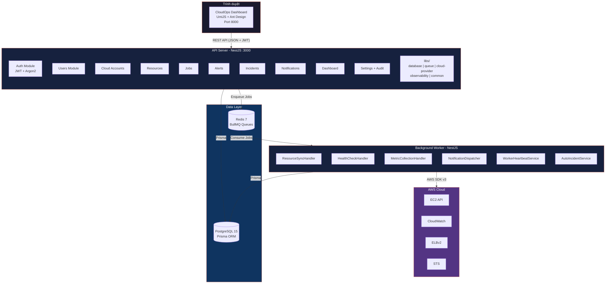
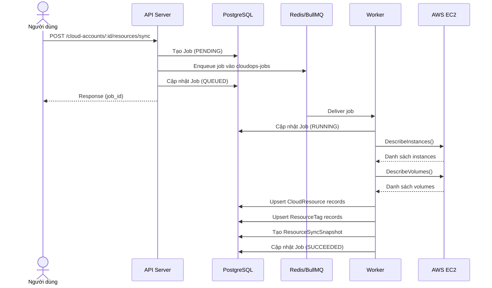
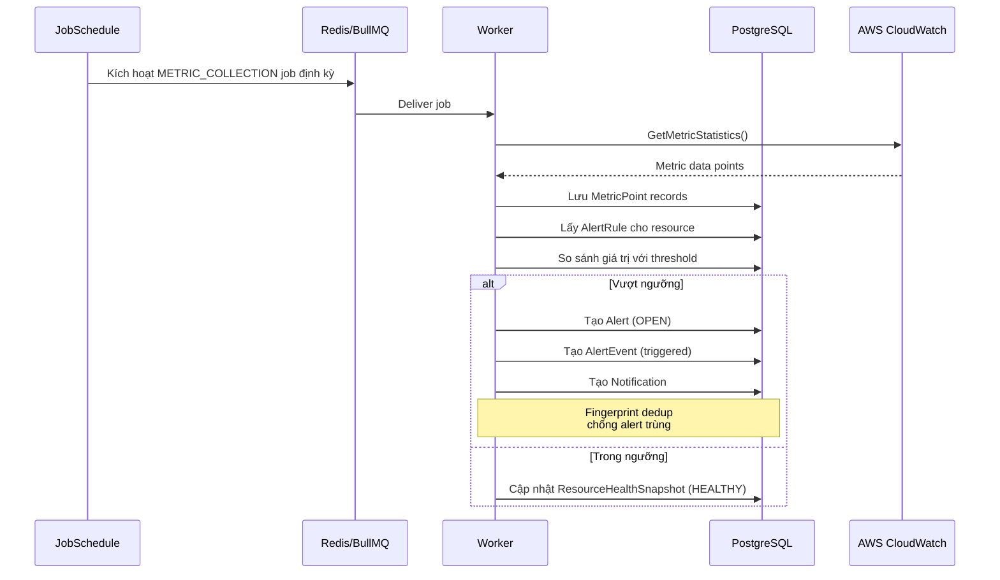
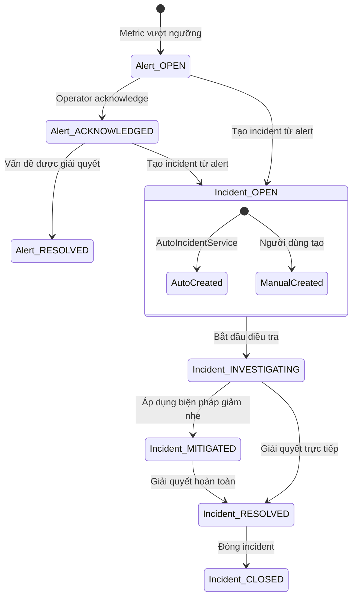
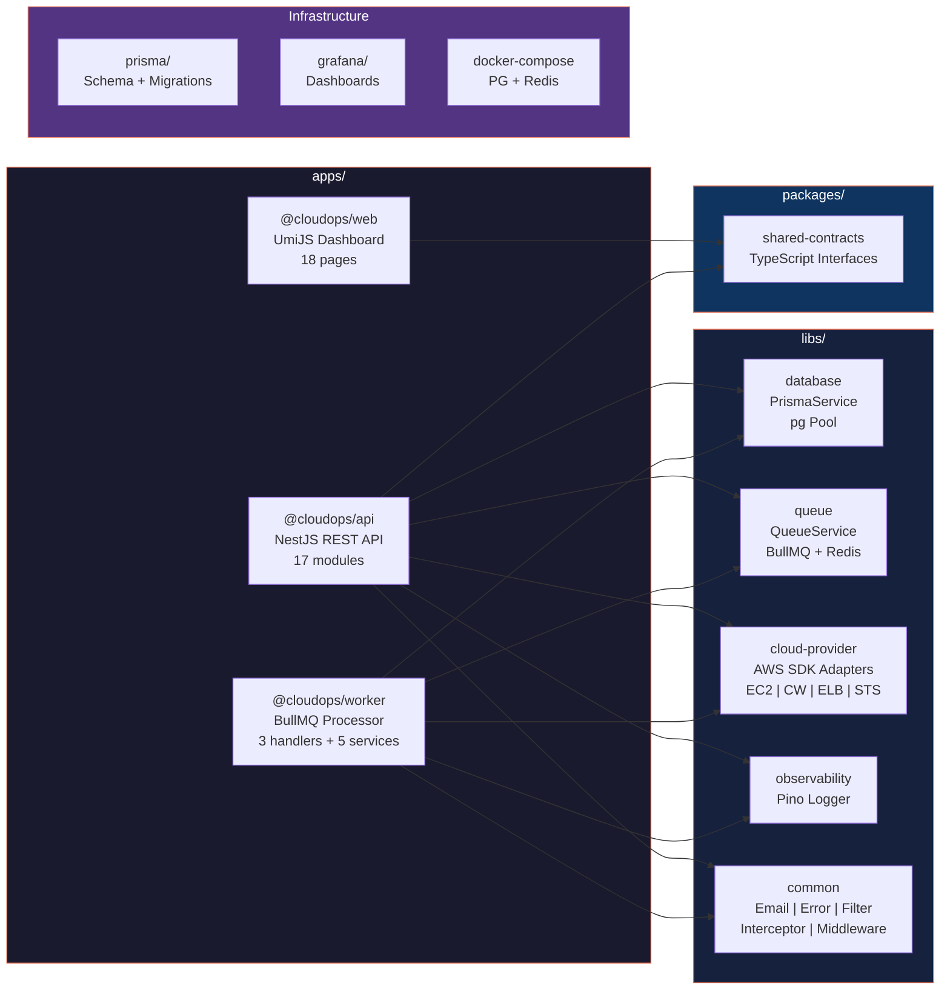
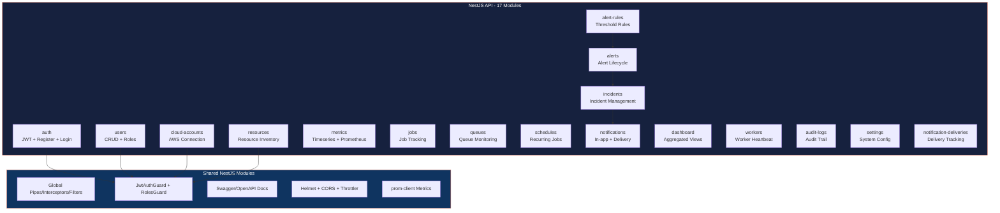
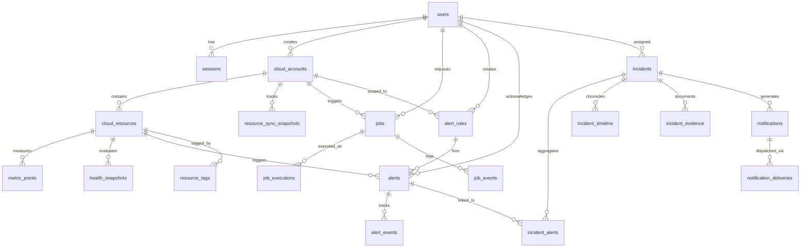

# Sơ đồ kiến trúc CloudOps

Các sơ đồ dưới đây mô tả kiến trúc hệ thống CloudOps, có thể hiển thị trực tiếp trên GitHub hoặc bất kỳ trình xem Mermaid nào.

## 1. Tổng quan hệ thống

## 2. Luồng đồng bộ tài nguyên

## 3. Luồng cảnh báo (Alerting)

## 4. Luồng quản lý sự cố (Incident)

## 5. Cấu trúc Monorepo

## 6. Module chi tiết của API

## 7. Database - Các Domain chính

> **Lưu ý**: Các sơ đồ trên sử dụng Mermaid syntax và có thể hiển thị trực tiếp trên GitHub, GitLab, hoặc bất kỳ Markdown viewer nào hỗ trợ Mermaid.
